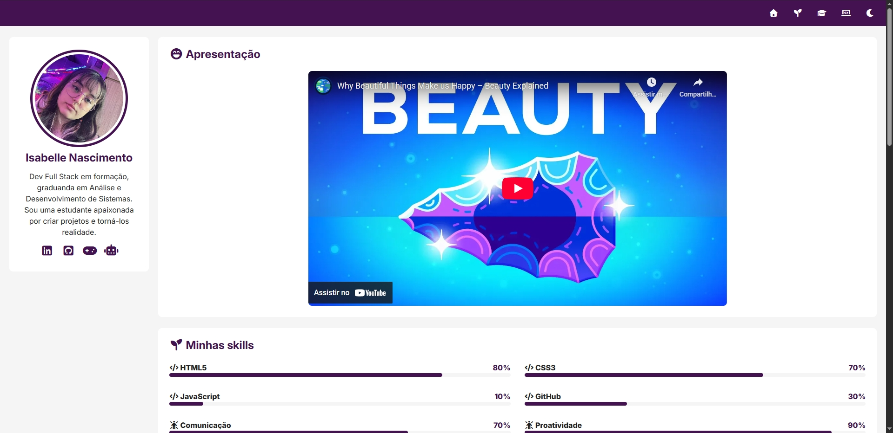

# Portfólio
Projeto Final do Curso de HTML e CSS do Curso em Vídeo: Portfólio de projetos realizados em aula.

---

## Overview

## Tabela de Conteúdo
+ [Sobre](#about)
+ [Etapas](#steps)
+ [Tecnologias](#technologies)
+ [Aprendizados](#knowledge)
+ [Obstáculos](#issues)
+ [Agradecimentos](#thanks)

## Sobre 
O projeto foi desenvolvido para acompanhar aulas gravadas do curso de HTML5 e CSS3 da plataforma Curso em Vídeo. Se tratando de um trabalho para conclusão do módulo final do curso, o objetivo principal proposto foi reunir todo aprendizado das aulas ministradas e aplicar em um único website.
O portfólio realizado é de fácil uso para o contexto profissional, visando comunicação com recrutadores e exposição rápida de soft-skills e conhecimento técnico.

## Etapas 
- Compreender o escopo do projeto, incluindo o conteúdo que seria utilizado, seu objetivo e uso esperado em sua conclusão.
- Estruturar a base do website em HTML semântico, organizando tudo que seria necessário em cada elemento trabalhado: IDs, Classes e links para CSS, favicon e script em JS.
- Configuração visual seguindo Mobile-First: organização de objetos, cores, fontes e proporções apropriadas seguindo a média de tamanho de dispositivos móveis atuais.
- Desenvolvimento de responsividade em Media Query, tendo em mente visualização em desktop, tablet e outras telas em maiores resoluções.
- Integração do script em JS disponibilizado pelo professor, possibilitando as funcionalidades de modo dark e scroll suave (através de IDs e Classes determinadas em CSS).

## Tecnologias 

    

## Aprendizados 

1. Uso correto e adaptações de Grid Layouts e Flexbox, principalmente no contexto de conteúdo real e longo.
2. Organização de CSS, com foco especial em nomenclaturas claras e diretas aos elementos.
3. Como implementar e utilizar o Font Awesome para ícones.
4. Maneiras de contornar problemas com conteúdo conflitante visualmente (z-index).
5. Integração com JS e bom uso de variáveis (para viabilizar o modo escuro e claro em scripts).

## Obstáculos 

- Falta de vídeo para compor o conteúdo da seção de "Apresentação", o qual deveria conter um vídeo de apresentação.
    - Solução: Problema de baixa complexidade, a produção de um vídeo e postagem no Youtube para incorporação resolverá esse impedimento.
- Pouco conhecimento em JavaScript.
    - Solução: Problema de longa resolução (estudo prolongado), porém que não afetou a realização do projeto, pois tudo relacionado à linguagem foi explicado, disponibilizado pronto e orientado pelo professor.

`Overview: Projeto realizado em perfeitas condições de aprendizado e pleno entendimento de etapas para melhor desenvolvimento de habilidades técnicas.`

---

## Agradecimentos 

Um agradecimento especial ao professor excelentíssimo [Gustavo Guanabara](https://github.com/gustavoguanabara), por sua didática e paciência impecável ao ensinar, o tato humano em aconselhar e se preocupar genuinamente com o aprendizado e trajetória de seus alunos.